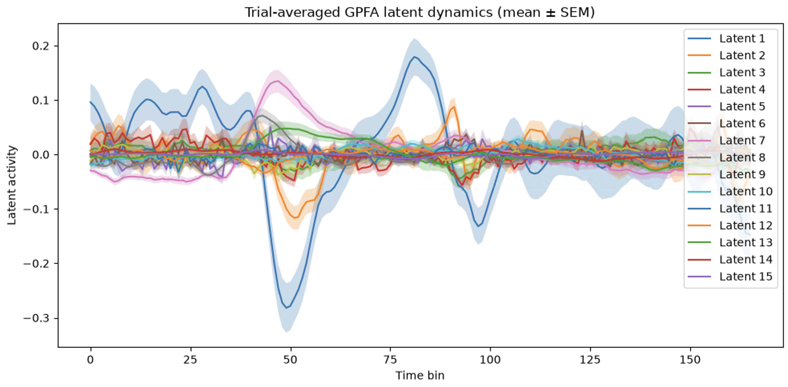
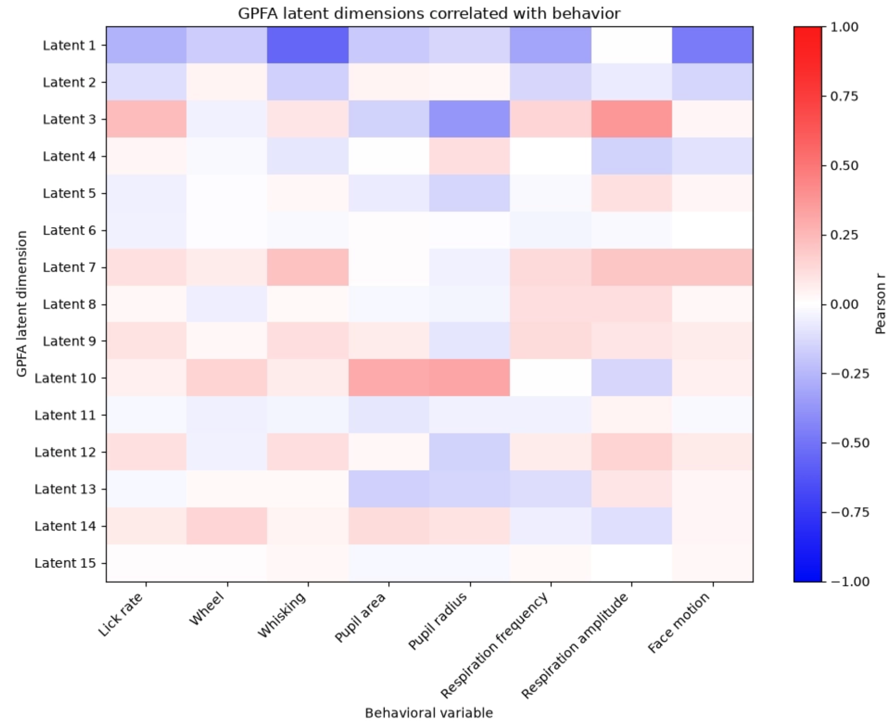
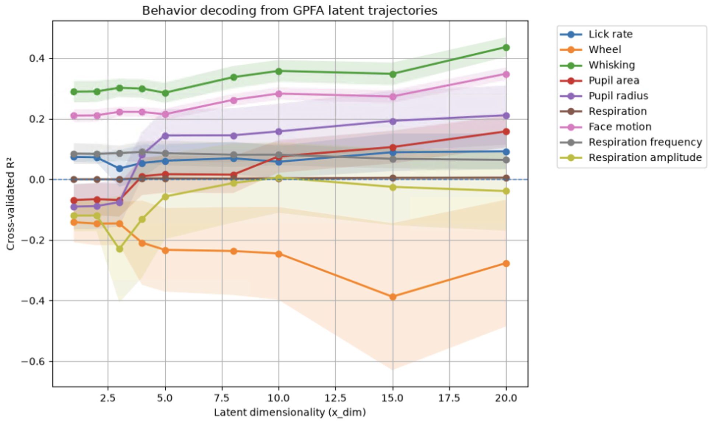
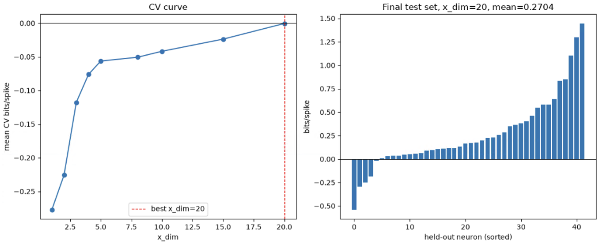
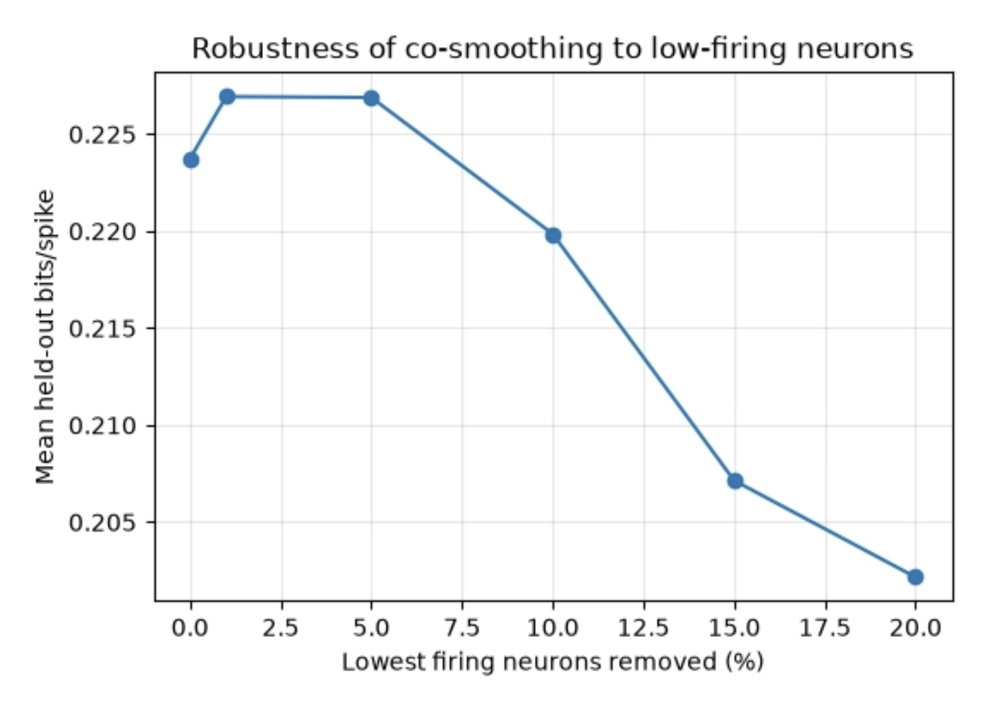

# GPFA Latent Dynamics Analysis

This repo fits **Gaussian Process Factor Analysis (GPFA)** to single-unit spiking
data from extracellular recordings, in order to extract low-dimensional latent
trajectories that summarize population-level neural dynamics on a trial-by-trial
basis, and evaluates how good those latent trajectories actually are using
multiple complementary metrics.

<p align="center">
  
</p>

## Notebooks in this repo

### `GPFA_analysis.ipynb` — fit GPFA and select dimensionality

Walks through the full pipeline for a single session:

1. **Load session data** — spikes and trial event times for a recording session
2. **Unit selection** — keep well-isolated ("good") units with enough spikes to
   support GPFA fitting
3. **Build GPFA-ready trials** — convert raw spike times into per-trial,
   per-neuron spike trains aligned to trial onset
4. **Cross-validate latent dimensionality** — fit GPFA across a range of candidate
   dimensionalities and score each by leave-neuron-out prediction error, with a
   held-out test set for a final unbiased evaluation
5. **Fit the final model** at the selected dimensionality and save results
6. **Visualize latent trajectories** — single-trial and trial-averaged dynamics,
   3D trajectories, latent traces alongside spike rasters, and the GPFA loading
   matrix
7. **Relate latents to behavior** — correlate each latent dimension with measured
   behavioral variables (e.g. licking, whisking, pupil size, respiration)
<p align="center">
  
</p>

### `behavior_decoding.ipynb` — behavioral decoding evaluation

Asks a more direct question than the correlation check in step 7 above: can a
simple linear decoder actually **predict** behavior from the GPFA latents,
cross-validated across trials and swept across latent dimensionality? See
[Evaluating Latent Variable Models](#evaluating-latent-variable-models) below
for how this fits into the broader evaluation picture.

1. **Load session data, select units, build GPFA trials** — same
   data-preparation steps as `GPFA_data.ipynb`
2. **Bin spike trains** for GPFA at the chosen `BIN_SIZE_MS`
3. **Single-behavior decoding walkthrough (lick rate)** — bin lick rate into
   GPFA time bins, then for each candidate `x_dim`: fit GPFA on training
   trials, transform held-out test trials, and score a cross-validated Ridge
   regression decoder (R²) predicting lick rate from the latents
4. **Multi-behavior decoding sweep** — repeat the same procedure for every
   measured behavior (wheel velocity, whisking, pupil area/radius,
   respiration, face motion) at once, reusing each fold's fitted GPFA model
   across behaviors, and plot cross-validated R² vs. dimensionality for all
   behaviors together
<p align="center">
  
</p>

### `cosmoothing.ipynb` — co-smoothing evaluation (bits per spike)

Asks whether the fitted GPFA model explains the raw spiking data itself —
specifically, whether its latents generalize to *neurons it never saw during
fitting*, not just new trials. See
[Evaluating Latent Variable Models](#evaluating-latent-variable-models) below
for how this fits into the broader evaluation picture.

1. **Load session data, select units, build GPFA trials** — same
   data-preparation steps as the other notebooks
2. **Held-in/held-out neuron split and train/test trial split** — held-in
   neurons are used to fit GPFA and a latent→rate bridge; held-out neurons are
   only ever scored
3. **Diagnostics** — firing-rate and spike-count distributions for held-in vs.
   held-out neurons, to check the split is reasonable and see where low-firing
   neurons sit
4. **Bridge method** — fit GPFA on held-in neurons, bridge latents → held-in
   rates via linear regression, then bridge held-in rates → each held-out
   neuron's spikes via a Poisson GLM; score held-out predictions in bits/spike
   relative to a constant-rate null model
5. **Cross-validate latent dimensionality** by mean held-out bits/spike, with a
   final unbiased score on a held-out test set
<p align="center">
  
</p>

7. **Robustness check** — how sensitive the co-smoothing score is to removing
   low-firing held-in neurons, used to choose a firing-rate cutoff for the
   final evaluation
<p align="center">
  
</p>

## Evaluating Latent Variable Models

Fitting GPFA and picking a dimensionality via leave-neuron-out cross-validation
(as in `GPFA_data.ipynb`) answers one specific question: *which dimensionality
captures shared structure in the population's activity without overfitting to
noise?* That's the approach from the original GPFA paper
([Yu et al., 2009](https://doi.org/10.1152/jn.90941.2008)), and it's a good
starting point — but it's only one lens on model quality.

[Neural Latents Benchmark '21](https://arxiv.org/abs/2109.04463) (Pei, Ye,
Zoltowski et al., 2021) introduces a more standardized evaluation framework for
latent variable models (LVMs) of neural population activity, built around
several complementary metrics rather than a single score. The table below
summarizes those metrics and how each is used in this repo:

| Metric | What it tells us | Why we need it |
| --- | --- | --- |
| **Leave-neuron-out prediction error (MSE)** | How well the trajectory captures correlated firing rates across the population. | A fundamental, distance-based measure of predictive ability that works for both probabilistic and non-probabilistic methods. |
| **Co-smoothing (bits per spike)** | How well the model fits the raw neural data. | Ensures the model isn't just "hallucinating" structure that isn't there. |
| **Behavioral decoding (R²)** | How well the latent signals relate to actual movement/behavior. | Shows the latents are biologically grounded, not just math that happens to fit the spikes. |
| **PSTH matching** | How well the model captures stereotyped, repeated response patterns. | Checks whether the model reconstructs the trial-averaged ("PSTH") response well. |
| **Forward prediction** | How well the model predicts future activity. | Tests whether the model has learned the dynamics governing how the brain's state evolves over time, not just its instantaneous structure. |

**Metric-specific notebooks in this evaluation suite:**

- Cross-validated held-out-trial neural reconstruction error (MSE) — `GPFA_data.ipynb`
- Co-smoothing evaluation using held-out bits per spike — `cosmoothing_bps.ipynb`
- Behavioral decoding from GPFA latent trajectories — `behavioral_decoding.ipynb`

PSTH matching and forward prediction aren't implemented in this repo yet. As
more of these evaluations are added, each should get its own notebook and a
short entry here describing what it measures and how it complements the
others — no single metric here is meant to stand alone as "the" measure of
model quality.

## Requirements

- Python 3.11
- [`elephant`](https://elephant.readthedocs.io/) (spike train analysis + GPFA)
- [`neo`](https://neo.readthedocs.io/) and [`quantities`](https://python-quantities.readthedocs.io/)
- `numpy`, `scipy`, `scikit-learn`, `matplotlib`

```bash
pip install elephant neo quantities numpy scipy scikit-learn matplotlib
```

Both notebooks also depend on two local modules from this repo, imported via a
path relative to the notebook's location:

- `data_paths.py` — a `DATA_PATH` dict mapping session keys to `.mat` file paths
- `Analysis_library/` — a local package providing `file_loading.SessionData` (for
  loading a session's spikes/trial data) and `analysis.get_good_units` (for
  filtering to well-isolated units)

Update `data_paths.py` to point at your own data before running.

## Usage

### `GPFA_data.ipynb`

1. Set `SESSION_KEY` in the "Load Session Data" section to the session you want
   to analyze.
2. Adjust analysis parameters as needed:
   - `BIN_SIZE_MS` — GPFA time-bin width (default 30 ms; consider 10 ms for finer
     temporal resolution at the cost of more compute)
   - `PRE_TRIAL_S` / `POST_TRIAL_S` — trial window around each trial event
   - `MIN_SPIKES` — minimum total spikes for a unit to be included
   - `X_DIMS` — candidate latent dimensionalities to cross-validate over
   - `N_FOLDS` — number of cross-validation folds
3. Run the notebook top to bottom. The cross-validation section is the slowest
   step (it fits `len(X_DIMS) * N_FOLDS + 2` GPFA models).
4. Fitted models and results are saved to `ISS/gpfa_results.pkl`.

For the behavior-correlation section at the end, you'll need a `binned_behaviors`
dict (behavior name → array of shape `[trials, time bins]`, aligned to the same
trial windows and bin size used above) — this notebook doesn't build it, so load
or construct it from your session's behavioral traces first.

### `behavioral_decoding.ipynb`

1. Set `SESSION_KEY` and the binning/trial-window parameters the same way as in
   `GPFA_data.ipynb` (these are independent notebooks, so parameters aren't
   shared automatically — keep them consistent if you want comparable results).
2. Adjust `X_DIMS` to the dimensionalities you want to sweep for decoding, and
   `N_DECODE_FOLDS` / the `KFold` settings for cross-validation.
3. Run top to bottom. The multi-behavior sweep (Section 5) is the slowest step —
   it fits `len(X_DIMS) * n_folds` GPFA models, each reused to decode every
   behavioral variable.
4. Behavioral signals are pulled directly from `s.data["behavior"]` and
   `s.data["physiology"]` — if your session's data structure uses different
   keys, update the `behavior_signals` dict in Section 5 accordingly.

### `cosmoothing_bps.ipynb`

1. Set `SESSION_KEY` and binning/trial-window parameters the same way as in
   the other notebooks (again, independent notebooks — keep parameters in
   sync for comparable splits).
2. Adjust `X_DIMS` and `N_FOLDS` for the dimensionality cross-validation, and
   `MIN_TEST_SPIKES` (Section 6.3) if you want a different low-spike cutoff
   for evaluated held-out neurons.
3. Run top to bottom. Section 7's CV loop is the slowest step — it fits one
   GPFA model, one linear regression, and one Poisson GLM per held-out neuron,
   for every fold and every `x_dim`.
4. After the CV curve and final per-neuron plot (Section 7.1), Section 8 runs
   a robustness sweep at a fixed dimensionality (`FIXED_X_DIM`, default `10` —
   update this if your CV picks a different best `x_dim`) to check how
   sensitive the co-smoothing score is to low-firing held-in neurons, then
   applies a chosen cutoff (`CHOSEN_CUTOFF_PERCENT`) for a final filtered score.

## Known limitations / TODOs

- The final GPFA model in `GPFA_data.ipynb` isn't currently saved in a form
  that supports inference on new data without refitting.
- Raster plots aren't yet shown alongside every latent trajectory plot.
- The behavior-correlation analysis in `GPFA_data.ipynb` assumes
  `binned_behaviors` has already been built elsewhere and doesn't validate its
  alignment with `binned_trials`.
- `behavioral_decoding.ipynb` and `GPFA_data.ipynb` each rebuild `gpfa_data`
  and `binned_trials` independently — if you're evaluating the same session
  across metrics, this means the two notebooks may not be using an identical
  train/test trial split unless `RANDOM_SEED` and fold settings are kept in
  sync.
- PSTH matching and forward-prediction evaluations from the Neural Latents
  Benchmark framework aren't implemented in this repo yet.
- In `cosmoothing_bps.ipynb`, the per-`x_dim` printout at the end of Section
  7.1 (`for d in X_DIMS: np.mean(final_bps_per_neuron[d])`) doesn't do what it
  looks like — `final_bps_per_neuron` is a flat list of per-neuron scores for
  the single final run at `best_x_dim`, not a dict keyed by dimensionality, so
  it indexes into that list positionally rather than looking up per-`x_dim`
  results. Use the CV curve (`cv_results`) for per-dimensionality comparisons;
  treat that printout as informational only until it's fixed.
- `cosmoothing_bps.ipynb`'s `FIXED_X_DIM` (used for the robustness sweep in
  Section 8) is hardcoded rather than automatically pulled from the CV result
  in Section 7 — update it manually if cross-validation picks a different best
  dimensionality.

## Output

- `ISS/gpfa_results.pkl` (from `GPFA_data.ipynb`) — pickled dict containing the
  fitted GPFA model, estimated parameters, selected `x_dim`, cross-validation
  errors, unit selections, and the analysis settings used to produce them.
- `behavioral_decoding.ipynb` doesn't currently save results to disk — CV R²
  scores per behavior/dimensionality live in the `behavior_scores` and
  `all_results` dicts in-notebook, and are surfaced via the summary plots.
- `cosmoothing_bps.ipynb` doesn't currently save results to disk either —
  CV bits/spike per dimensionality lives in `cv_results`, final per-neuron
  scores in `final_bps_per_neuron`, and the robustness sweep in
  `percentile_results`, all surfaced via the in-notebook plots.
